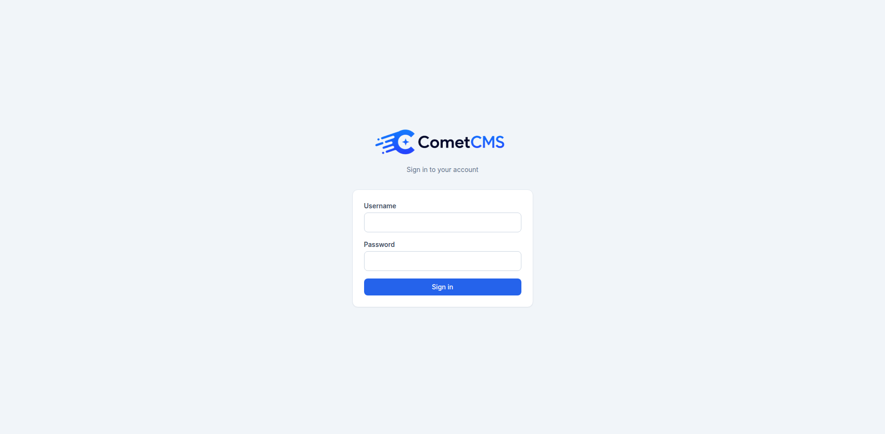

# First Login

## Setup screen

When you visit `/admin` for the first time (or after a [user reset](./recovery)), CometCMS shows the **setup screen** instead of the login page.

Enter a username and password (minimum 8 characters), then choose the first workspace name (optional custom slug).

Submitting setup creates:

- The initial admin account.
- The initial workspace.
- The default workspace assignment (used as the admin workspace fallback when `X-Comet-Workspace` is not set).

This admin account is the only account that can access the panel until more users are added.



## Admin URL

The admin panel is always available at:

```
https://yourdomain.com/admin
```

## Logging in

Enter your username and password. Sessions are server-side (PHP sessions stored in `cms/storage/sessions/`).

After login, you can add more workspaces in **Settings -> Workspaces**. See [Workspaces](./workspaces) for routing, isolation, and permission scoping details.

## Your profile

Click your **name or avatar in the bottom-left corner of the sidebar** to open your profile page where you can:

- Upload or remove your profile picture
- Change your display name and email address
- Set a new password (requires entering your current password first)
